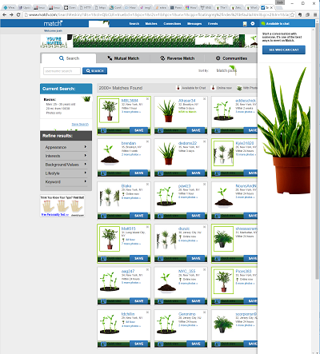

# plantWAP
Transparently injects nature into your browsing experience

## Examples

### Wall Street Journal 


[full size](images/WSJ for Plants.png)


### New York Times


[full size](images/NYT for Plants.PNG)

### Feedly


[full size](images/Feedly for Plants.png)

### Match.com


[full size](images/Match for Plants.PNG)


## Background

Created for this project...

http://tegabrain.com/Selected-Work/Eccentric-Engineering


## Installation

Runs on either... 
 * Raspberry Pi 3 
 * Raspberry Pi 2 with [suitable Wifi adapter](http://amzn.to/1UaJ6wX)

 
You will also need a 2GB+ SD card. 

1. Download latest plantWAP release image under the `releases` tab above
2. Burn it onto the SD card like [this](https://www.raspberrypi.org/documentation/installation/installing-images/)
3. Insert the card into the Pi and turn it on! 
4. After it boots, connect to the Wifi network that looks like a little plant (🌱)
5. To test, you can pull up [this image](http://josh.com/joshpete.gif), which should look like a plant and not two white guys


## Limitations

1. Only replaces images on `http` connections. Does nothing to images loaded on `https` connections.
2. Only replaces images with URL file names that end in standard image extentions (ie. `png`, `gif`, `jpg`, etc). Does nothing to images that do not follow these naming conventions even if they have an image MIME type. 
3. It sometimes takes a minute or two before connections from Chrome on Andriod are intercepted. This is likey due to an [Android/Chomium bug](https://bugs.chromium.org/p/chromium/issues/detail?id=339473).


Note that some or all of these limitations could likely be mitigated or cured with more effort. 

## Customization

You can replace the images in the `/etc/plants` with anything you want (does not need to be plants). 

* If you use small or low res images, they will look crappy when they are scaled to repalce large source images
* If you use large and hi res images, they will take longer to resize so there will be a longer delay the first time an image is injected at a given size


After you change the images, you will should clear the cache and restart the server by entering...

```
sudo rm /var/www/html/images/*
sudo squid3 -k reconfigure
```

## Theory of Operation

1. A standard `HOSTAPD` manages the Wifi access point
2. An `iptables` redirect sends all `http` connections to a local `squid3` server 
2. The `squid3` server is set up to run as a `transparent` proxy on port 3128. It runs the url_rewrite_program `/etc/sqrewrite.sh` on each incoming request.
3. The `sqrewrite.sh` script checks the file extention on each request to see if it ends in a common image extention. If not, it passed the request unchanged.
4. If the request was for an image, then we go out and grab the requested image using `wget` and save it to a temp file. 
5. We use `image-magick` to inspect the downloaded image and get the dimensions.
6. Using hash of the oringal URL, we pick one of the repalcement images in `/etc/plant` to inject. Using a hash means that the same orginal image should always get the same replacement so pages look the same when refreshed.
7. We again use `image-magick` to resize the selected repalcement to match the original and save the result in `/var/www/html/images` with a file based on which repalcement images we used and the size. Note that this step can cause some delay if the replacement image is large, but hopefully we only need to resize once per replacement image at a given size. 
8. The script returns the path to the newly generated resized replacement image on the local `appache2` http server on port 81.
9. `squid3` returns the injected image to the browser!

## Tricky parts

###  Unicode SSID

To make an SSID with a unicode char in it, enter...

`echo -e "\x1f331"`

...where `1f331` is the hex of the unicode you want (`1f331` is a plant). 

This will give you a mangled looking thing that you can then paste into the `\etc\hostapd\hostapd.conf` SSID field. 

### Googles magic proxy pipe

Did you knwo that every http request from Chome running on Android is proxied though Google servers? Me neither! All documented here...

https://developer.chrome.com/multidevice/data-compression-for-isps

... except [the cannary does not work as documented](https://bugs.chromium.org/p/chromium/issues/detail?id=339473)!!!

To try and cure this, we...

1. Do intercept the cannary URL with these lines in the rewrite script (even though it seems to do nothin)...

  ```
  if [[ $url == "http://check.googlezip.net/connect" ]]; then 

		echo "$(date +%H%M%S): Chrome DCP came a knocking and we sent them a walking"
		echo "OK url=\"http://192.168.42.1:81/dont_proxy_me\""
	
	else
  ```

2. Try to block the outbound `https` connection to the proxy with...
  
  ```
  sudo iptables -A FORWARD -i wlan0 -d compress.googlezip.net -p tcp --dport 443 -j DROP
  ```

The combination of these two seems to work, although I have not looked deeper to see if both are nessisary or if there might be a better way to block those connections wiothout incuring a reverse DNS lookup on every outbound `https` connect. 

### Redirect to local server blocked!

I didn't want to hard code the IP address of the local server into the rewrite script, so instead I sent the connection to 127.0.0.1, but it didn't work! Checking ther `iptables`, there was no rule that should be blocking these packets. 

It turns out there is a hard coded rule in the kernel that blocks these packets! How do you Linux people live like this?

Easy enough to fix once you ([somehow?](http://unix.stackexchange.com/questions/111433/iptables-redirect-outside-requests-to-127-0-0-1)) know it is there...

```
sysctl -w net.ipv4.conf.wlan0.route_localnet=1
```


